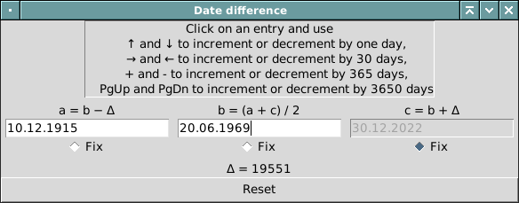
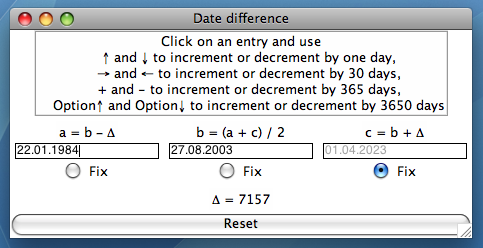

This is a tool to see whether an event is closer in time to another event
than it is to a third event (by default, the third event is today). Examples, as of December 2022:

- Creation of Linux (August 1991) is closer to creation of Unix
(August 1969) than it is to today
- Discovery of radium (1898) is closer to discovery of oxygen (1778) than it is to today
- The fall of the Berlin Wall (9 November 1989) is closer to its construction (13 August 1961) than it is to today
- Darwin's *On the Origin of Species* (1859) is closer to the Spanish conquest of the last Maya kingdom (1697) than it is to today

# What It Looks Like



# Requirements

- Python 3.7 or later with tkinter support

# Installation

This will install the tool to your home directory in editable mode.

```sh
git clone https://github.com/Zabolekar/closer-in-time
cd closer-in-time
python3 -m pip install -e .
```

Beware: if you want it to be installed inside a virtual environment,
create the environment manually *before* installing the package.

# Usage

```sh
python -m closer-in-time
```

# Mac OS X Leopard Port

There is a port for Mac OS X Leopard where installing a newer Python version with tkinter is not trivial. It uses Python 2.5, and also slightly different keys (⌥Dn ⌥Up instead of PgDn PgUp). It doesn't support years before 1900. Use it like this:

```sh
git clone https://github.com/Zabolekar/closer-in-time
cd closer-in-time
git switch python2.5
python src/closer-in-time/__main__.py
```


